# kNN分类算法

## 1. 数据集

数据集的散点图,举例.  注意: mglearn,matplotlib的使用.


```python
import mglearn
import matplotlib.pyplot as plt

# generate dataset
X,y = mglearn.datasets.make_forge()
# X是一个二维的np数组
print(X[:,0])
# y是一个一维的np数组

# plot dataset
mglearn.discrete_scatter(X[:,0],X[:,1],y)
plt.legend(["Class 0", "Class 1"])
plt.xlabel("X1")
plt.ylabel("X2")
print("X.shape:{}".format(X.shape))
plt.show()

```

    [ 9.96346605 11.0329545  11.54155807  8.69289001  8.1062269   8.30988863
     11.93027136  9.67284681  8.34810316  8.67494727  9.17748385 10.24028948
      8.68937095  8.92229526  9.49123469  9.25694192  7.99815287  8.18378052
      8.7337095   9.32298256 10.06393839  9.50048972  8.34468785  9.50169345
      9.15072323 11.563957  ]
    X.shape:(26, 2)
    


    <Figure size 640x480 with 1 Axes>


特征数目: 2
样本数目: 26
类别: 2

kNN分类算法是最简单的机器学习算法. 我们要先自己构建该算法, 这样非常有助于我们理解.而不是简单地调用已有的库函数.


问题: 对于一个我们从未见过的数据样本,我们想知道它属于什么类别. (做图,如上.)

kNN算法从整个训练集里找出离这个新数据样本最近的邻域内的样本.

然后,该算法做一个关于类别的投票(mode vote),从而决定新的样本属于哪一类.

因为必须计算新样本到所有训练样本的距离,

kNN的执行速度依赖于类别的数目,以及样本的数目.


我们可以用任意我们自定义的距离函数,而不必局限于欧几里得距离.

极端一点的例子: 0 或1,对那些名义上的特征可用.
    
理解kNN比较容易,因而它称为数据科学家学习的第一个机器学习算法.

当我们想用程序写一个分类器时,我们可以考虑用kNN算法.

## 2. 求N维空间中两点之间的距离


```python
import numpy as np

def distance(p1, p2):
    """返回两点间的距离(欧几里得距离, Euclidean distance)
       这个定义具有普遍性,可用于计算N维空间中的两点的距离.
    """
    return np.sqrt(np.sum(np.power(p1 - p2, 2)))

a = np.array([4,0])
c = np.array([4,3])


print(distance(a,c))

x = np.array([0,0,0,0])
y = np.array([4,3,2,2])

print(distance(x,y))

# 附: 求出OA与OC的夹角.
a = np.array([4,0])
c = np.array([4,3])
o = np.zeros(2)
len_OA = distance(a,o)
len_OC = distance(c,o)
cos_theta = np.sum(a * c) / (len_OA * len_OC)
print(np.arccos(cos_theta))

```

    3.0
    5.744562646538029
    0.6435011087932843
    

## 3. 投票函数


```python
# 类似于求词频的函数count_words(text), 定义如下函数count_votes(votes).

def count_votes(votes):
    count_dict ={}
    for vote in votes:
        # known word
        if vote in count_dict:
            count_dict[vote] += 1
        else:
            count_dict[vote] = 1
    return count_dict

# 定义一个序列
votes = [1,2,1,3,4,2,2,2,3,3,2,3,3]

# 调用函数,得到字典
vote_count = count_votes(votes)
vote_count
```


    {1: 2, 2: 5, 3: 5, 4: 1}


在上面的例子中,序列votes中,2 出现了5次. 次数最多,频率最高. 问,我们如何把出现频率最高者找到并提取出来呢? 


```python
max(vote_count.keys())
```


    4


```python
max(vote_count.values())
```


    5


```python
max_count = max(vote_count.values())
max_count
```


    5


items()方法: 提取出关键字和对应的值.


```python
for vote, counts in vote_count.items():
    print(vote, counts)
```

    1 2
    2 5
    3 5
    4 1
    

一个序列中可能有多个最高频者(胜利者). 所以我们用列表来保存它们,命名为winners.


```python
winners = []
max_count = max(vote_count.values())
for vote, counts in vote_count.items():
    if counts == max_count:
        print(vote, counts)
        winners.append(vote)
        print(winners)

```

    2 5
    [2]
    3 5
    [2, 3]
    

进一步简化函数


```python
def majority_vote(votes):
    count_dict ={}
    
    for vote in votes:
        # 已见过的选项(vote)
        if vote in count_dict:
            count_dict[vote] += 1
        # 未见过的选项
        else:
            count_dict[vote] = 1
            
    winners = []       
    max_count = max(count_dict.values())
    for vote, counts in count_dict.items():
        if counts == max_count:
            winners.append(vote)
    return winners     # 注意缩进

majority_vote(votes)
```


    [2, 3]


进一步修改, 我们只需要从众多的胜利者中选出一个就可以了.所以我们随机选择一个. 引用random模块,修改如下:


```python
import random 

def majority_vote(votes):
    count_dict ={}
    
    for vote in votes:
        # 已见过的选项(vote)
        if vote in count_dict:
            count_dict[vote] += 1
        # 未见过的选项
        else:
            count_dict[vote] = 1
            
    winners = []       
    max_count = max(count_dict.values())
    for vote, counts in count_dict.items():
        if counts == max_count:
            winners.append(vote)
    return random.choice(winners)

majority_vote(votes)
```


    3


一个序列(或其他数据结构)中的最高频者,常称为模式(Mode),或称众数.

找出一个序列中最高频的元素,是统计学中的极其常见和基本的操作. 

如何找到一个NumPy数组的众数呢?  

scipy.stats.mode()可直接实现之. 
majority_vote(votes)更简洁的版本如下:


```python
import numpy as np
import scipy.stats as ss # 导入scipy.stats(约定)

def majority_vote_simple(votes):
    """
    返回序列中的最高频元素.
    输入:NumPy数组
    """
    mode, count = ss.mstats.mode(votes)
    return mode

votes = [1,2,1,1,2,3,1,5,6,3]
votes = np.array(votes)
majority_vote_simple(votes)
```


    array([1.])


```python
random.choice([2])
```


    2


## 4. 如何找到最近邻居?

### 4.1 什么是"最近邻居"?
前提: 空间, 距离.

操作: 比较距离的大小,排序.

### 4.2. 找出最近邻居

"求最近邻居算法"之基本思想:

     对所有的点:
         求出其中一点p与其他各点的距离
     对距离排序,并返回离p点最近的k个点 

举例如下:
       


```python
# 先举例:可视化所有的点

import matplotlib.pyplot as plt

points = np.array([[-1,-1],[-1,0],[-1,1],[0,-1],[0,0],[0,1],[1,-1],[1,0],[1,1]]) 
p = np.array([-.5, 0])

plt.plot(points[:,0], points[:,1], "ob");
plt.plot(p[0],p[1], "or")

# 设置作图范围
plt.axis([-1.5,1.5,-1.5,1.5])
```


    [-1.5, 1.5, -1.5, 1.5]


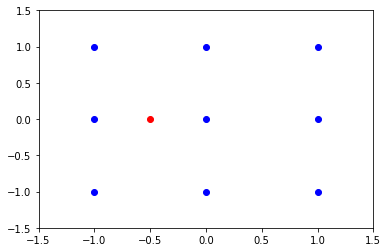


现在开始写函数.


```python

import matplotlib.pyplot as plt

points = np.array([[-1,-1],[-1,0],[-1,1],[0,-1],[0,0],[0,1],[1,-1],[1,0],[1,1]]) 
p = np.array([-.5, 0])

distances = np.zeros(points.shape[0])
for i in range(len(distances)):
    distances[i] = distance(points[i],p)

# 打印出points中的点与p点的距离.
print("p点与序列中的点的距离:",distances)

plt.plot(points[:,0], points[:,1], "ob");
plt.plot(p[0],p[1], "or")

# 设置作图范围
plt.axis([-1.5,1.5,-1.5,1.5])
```

    p点与序列中的点的距离: [1.11803399 0.5        1.11803399 1.11803399 0.5        1.11803399
     1.80277564 1.5        1.80277564]
    


    [-1.5, 1.5, -1.5, 1.5]


如何对这些距离按由小到大顺序做排序?  NumPy中有一个这样的函数argsort(). 它返回最小的k个值的index.


```python
print(distances)
np.argsort(distances)
```

    [1.11803399 0.5        1.11803399 1.11803399 0.5        1.11803399
     1.80277564 1.5        1.80277564]
    


    array([1, 4, 0, 2, 3, 5, 7, 6, 8], dtype=int64)


最小的两个距离值是第2个点和第5个点. 距离都为0.5.


```python
# 将argsort()之返回值赋给一个索引对象ind.
ind = np.argsort(distances)
# 计算出距离值(由小到大排序):
distances[ind]
```


    array([0.5       , 0.5       , 1.11803399, 1.11803399, 1.11803399,
           1.11803399, 1.5       , 1.80277564, 1.80277564])


如果只想求距离最短的两个值,命令如下:


```python
distances[ind[:2]]

```


    (9, 2)


现在,我们可以写出求k个最近邻居的函数: find_nn(p,points,k)


```python
def find_nn(p,points, k=3):
    """
    返回(points集合中)距离p点最近的k个点的索引值.
    """
    #points.shape
    distances = np.zeros(points.shape[0])
    for i in range(len(distances)):
        distances[i] = distance(points[i],p)
    ind = np.argsort(distances)
    # 计算出距离值(由小到大排序):
    #return ind[0:k]
    return ind[:k]  

#计算最近邻居
k = 3
points = np.array([[-1,-1],[-1,0],[-1,1],[0,-1],[0,0],[0,1],[1,-1],[1,0],[1,1]]) 
p = np.array([-.5, 0])
ind = find_nn(p,points,k)
print("最近的{}个点的索引:\n{}".format(len(ind),ind))
print("最近的{}个点的坐标:\n{}".format(len(ind),points[ind]))

#作图
plt.plot(points[:,0],points[:,1],"bo")
plt.plot(p[0],p[1],"ro")
```

    最近的3个点的索引:
    [1 4 0]
    最近的3个点的坐标:
    [[-1  0]
     [ 0  0]
     [-1 -1]]
    


    [<matplotlib.lines.Line2D at 0x18079e39f98>]


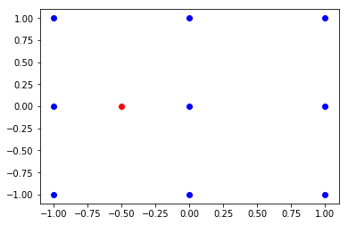


## 4. 预言一个新的点的类别(class)

写一个函数实现:预言一个新点的类别. 
    
    找出距离p点最近的k个邻居的索引值;
    选出这些邻居中落在各类的次数("类似词语出现的频率")
    


```python

def knn_predict(p, points, outcomes, k=3):
    """返回新点p的类别."""
    ind = find_nn(p, points, k)
    #print("ind: ",ind)
    return majority_vote(outcomes[ind])

# outcomes为已知点points的类别  
outcomes = np.array([0,0,0,0,1,1,1,1,1])
p = np.array([-.49,.5])
points = np.array([[-1,-1],[-1,0],[-1,1],[0,-1],[0,0],[0,1],[1,-1],[1,0],[1,1]])
res = knn_predict(p, points,outcomes,3)
print("所属类别:",res)

#作图
plt.plot(points[:,0],points[:,1],"bo")
plt.plot(points[:4,0],points[:4,1], "go")
plt.plot(p[0],p[1],"ro")
```

    所属类别: 1
    


    [<matplotlib.lines.Line2D at 0x18079e81e80>]


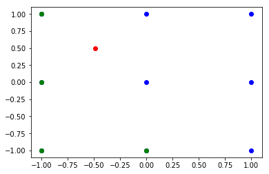


## 5. 产生数据

end points:

bivariate:

ipstats 模块


```python
# rvs(): 随机变量
ss.norm(0,1).rvs((5,2))
```


    array([[ 0.83069181, -0.62347007],
           [-0.2725449 ,  0.11232394],
           [-1.11716573, -0.44054168],
           [ 0.45781264,  1.3071023 ],
           [ 1.23865135,  0.83660122]])


```python
ss.norm(1,1).rvs((5,2))
```


    array([[ 1.35577686,  0.39040978],
           [-0.66636033,  0.93560858],
           [-0.41215857,  1.84704737],
           [ 0.1551123 , -1.05379079],
           [ 0.87793387, -0.03557217]])


```python
np.concatenate((ss.norm(0,1).rvs((5,2)), ss.norm(1,1).rvs((5,2))), axis =0)
```


    array([[-0.4071305 ,  1.0495255 ],
           [-3.45917693, -0.67421897],
           [-0.2545249 , -1.73763083],
           [ 0.76165822,  0.06027817],
           [ 0.31492657,  0.41800532],
           [ 3.23131752,  1.5114335 ],
           [ 1.25727685,  0.0283415 ],
           [ 0.75631692,  1.12605519],
           [ 2.44503412,  1.44955582],
           [ 1.55355979,  0.15840327]])


```python
def generate_synth_data(n=50):
    points = np.concatenate((ss.norm(0,1).rvs((n,2)), ss.norm(1,1).rvs((n,2))), axis =0)
    outcomes = np.concatenate((np.repeat(0,n),np.repeat(1,n))) 
    return (points, outcomes)

generate_synth_data(n=50)
    
```


    (array([[-0.16783697,  0.02050534],
            [ 0.33780707, -1.85746227],
            [ 1.1502792 ,  0.41800664],
            [ 0.44686681, -0.71024393],
            [ 0.2298997 ,  0.07213386],
            [-0.8118586 ,  2.40017804],
            [ 1.58433468, -1.39424132],
            [-0.24241004, -0.04255055],
            [ 0.41714192, -0.51050465],
            [-0.5280403 , -0.65786153],
            [-1.57055482,  1.27481566],
            [ 0.62697621,  0.26311523],
            [-1.43334422,  0.7390689 ],
            [ 1.67809832, -0.54769948],
            [-1.16425757,  0.50000568],
            [ 0.3132702 , -0.26666044],
            [ 0.67253587, -0.1422316 ],
            [ 0.50244811, -1.19014203],
            [-0.4274232 , -0.26463046],
            [ 1.79649483, -1.32868628],
            [ 1.13115787,  0.40142446],
            [-0.19614848, -0.22420655],
            [-0.90000798, -1.35075547],
            [ 0.94683432,  0.67866955],
            [ 1.86555968, -0.46159701],
            [ 0.43713084, -1.99728955],
            [ 1.19474333, -0.14155465],
            [-0.45634546, -0.32428328],
            [-1.48773399,  1.06669066],
            [ 0.3490665 ,  0.2199291 ],
            [ 0.47055561, -0.39828232],
            [-0.06526523,  0.11699479],
            [-1.32039946, -0.15029049],
            [-0.47599881, -1.07159337],
            [ 0.96077185,  1.20452941],
            [ 0.60819762,  0.02412181],
            [-1.0173916 , -0.67349799],
            [-1.23975311, -1.04363138],
            [ 0.94641183,  0.74220721],
            [-0.95052702,  0.38768245],
            [-1.59797228, -0.38475813],
            [ 0.19346684, -0.65746161],
            [ 1.56409047,  0.28242497],
            [ 0.6899779 , -0.38342675],
            [ 0.46711867, -1.59927686],
            [-0.32635659, -0.54757973],
            [-0.81629077, -0.90463963],
            [ 1.19953136, -0.42577912],
            [ 0.88766725,  0.64721389],
            [-0.68097159,  0.95144207],
            [ 0.15045745,  1.77308766],
            [ 3.04339892, -0.34359456],
            [ 0.56568942,  0.50108106],
            [ 1.09376479, -0.03832559],
            [ 0.39485443,  1.0304349 ],
            [ 1.36046384,  1.75720897],
            [ 2.5963883 ,  2.95865808],
            [ 1.71715505,  1.83740353],
            [ 1.023666  ,  2.46374039],
            [ 1.14120557,  0.45604872],
            [ 0.82877602,  1.04832503],
            [ 1.31745272, -0.29050699],
            [ 1.46701593,  0.03811428],
            [-0.62785548,  2.0345153 ],
            [ 1.55931117,  2.76731343],
            [ 0.09051937, -0.1641055 ],
            [ 0.76399475,  1.64064433],
            [ 0.35090569,  2.62914281],
            [ 2.17176319,  1.65748757],
            [ 0.19211115, -0.47875665],
            [ 0.05048023,  0.64249643],
            [-0.09274217,  0.51781046],
            [ 1.66872886,  0.93564912],
            [ 0.75201328,  1.36039831],
            [ 0.7924292 ,  0.05727138],
            [ 0.10401508,  1.94239822],
            [ 1.20988334,  1.82051461],
            [ 0.88733247,  1.87191994],
            [ 2.04219745, -1.21850758],
            [ 1.9898411 , -0.20849328],
            [ 0.41398302,  0.70738275],
            [ 1.84098048,  1.54562855],
            [-0.31238646,  1.36357364],
            [-0.86696625,  0.11060323],
            [ 1.38585139, -0.33003332],
            [ 0.70032967, -0.75433882],
            [ 0.86737276,  0.97686573],
            [-0.05449175,  1.5307324 ],
            [ 0.88908613,  1.21785863],
            [-0.70619254, -0.87929872],
            [ 0.51253895,  1.16199514],
            [ 2.27498099,  3.11982834],
            [ 3.25427128,  1.29038675],
            [ 1.67351004, -0.38864826],
            [ 1.60965757,  0.49361361],
            [ 1.06842001,  0.97564107],
            [-0.17121087,  2.61243406],
            [-1.03616523,  1.62495132],
            [-0.57657601,  1.5198456 ],
            [-1.17619214,  1.64543992]]),
     array([0, 0, 0, 0, 0, 0, 0, 0, 0, 0, 0, 0, 0, 0, 0, 0, 0, 0, 0, 0, 0, 0,
            0, 0, 0, 0, 0, 0, 0, 0, 0, 0, 0, 0, 0, 0, 0, 0, 0, 0, 0, 0, 0, 0,
            0, 0, 0, 0, 0, 0, 1, 1, 1, 1, 1, 1, 1, 1, 1, 1, 1, 1, 1, 1, 1, 1,
            1, 1, 1, 1, 1, 1, 1, 1, 1, 1, 1, 1, 1, 1, 1, 1, 1, 1, 1, 1, 1, 1,
            1, 1, 1, 1, 1, 1, 1, 1, 1, 1, 1, 1]))


```python
points, outcomes = generate_synth_data(n=50)

plt.figure()
n = 50
plt.plot(points[:n,0], points[:n,1], "ro")
plt.plot(points[n:,0], points[n:,1], "bo")
plt.savefig("bivaradata.pdf")
```


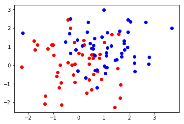


## 6. 制作预测Grid

    Learn how to make a prediction grid
    Learn how to use enumerate
    Learn how to use NumPy meshgrid


```python
def make_pred_grid(predictors,outcomes,limits,h,k):
    (x_min,x_max, y_min,y_max) = limits
    xs = np.arange(x_min,x_max,h) # h, 步长
    ys = np.arange(y_min,y_max,h)
    xx, yy = np.meshgrid(xs,ys)
    
    pred_grid = np.zeros(xx.shape, dtype = int)
    for i, x in enumerate(xs):
        for j, y in enumerate(ys):
            p = np.array([x,y])
            pred_grid[j,i] = knn_predict(p,predictors,outcomes,k)
            
    return (xx,yy,pred_grid)
```

## 7. 对格点作图 

    Learn how to plot the prediction grid
    Learn about the bias-variance tradeoff


```python

# 可下载
def plot_pred_grid (xx, yy, prediction_grid, filename):
    """ Plot KNN predictions for every point on the grid."""
    from matplotlib.colors import ListedColormap
    background_colormap = ListedColormap (["hotpink","yellowgreen","lightskyblue" ])
    observation_colormap = ListedColormap (["red","blue","green"])
    plt.figure(figsize =(10,10))
    plt.pcolormesh(xx, yy, prediction_grid, cmap = background_colormap, alpha = 0.5)
    plt.scatter(predictors[:,0], predictors [:,1], c = outcomes, cmap = observation_colormap, s = 50)
    plt.xlabel("x1"); plt.ylabel("x2")
    plt.xticks(()); plt.yticks(())
    plt.xlim (np.min(xx), np.max(xx))
    plt.ylim (np.min(yy), np.max(yy))
    plt.savefig(filename)
    

(predictors, outcomes) = generate_synth_data()

k = 5 ; filename = "knn_synth_5.pdf"
limits = (-3,4,-3,4) ;   h = 0.1

(xx,yy, pred_grid) = make_pred_grid(predictors,outcomes,limits,h,k)
plot_pred_grid(xx,yy, pred_grid, filename)


```


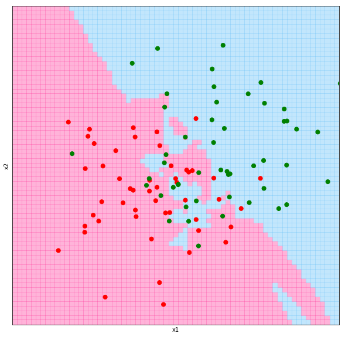


```python
(predictors, outcomes) = generate_synth_data()

k = 13 ; filename = "knn_synth_13.pdf"
limits = (-3,4,-3,4) ;   h = 0.1

(xx,yy, pred_grid) = make_pred_grid(predictors,outcomes,limits,h,k)
plot_pred_grid(xx,yy, pred_grid, filename)
```


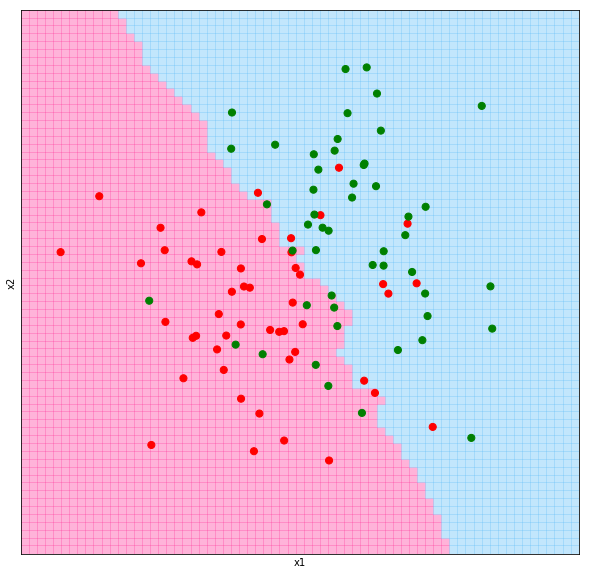


## 8. Scikit-learn的使用


```python
import pandas as pd
# 生成数据集: X中每个样本仅有一个特征. 
X_train = pd.DataFrame([ [0], [1], [2], [3] ])
y_train = [0, 0, 1, 1]
X_train
```


<div>
<style scoped>
    .dataframe tbody tr th:only-of-type {
        vertical-align: middle;
    }

    .dataframe tbody tr th {
        vertical-align: top;
    }

    .dataframe thead th {
        text-align: right;
    }
</style>
<table border="1" class="dataframe">
  <thead>
    <tr style="text-align: right;">
      <th></th>
      <th>0</th>
    </tr>
  </thead>
  <tbody>
    <tr>
      <th>0</th>
      <td>0</td>
    </tr>
    <tr>
      <th>1</th>
      <td>1</td>
    </tr>
    <tr>
      <th>2</th>
      <td>2</td>
    </tr>
    <tr>
      <th>3</th>
      <td>3</td>
    </tr>
  </tbody>
</table>
</div>


```python
y_train
```


    [0, 0, 1, 1]


导入SciKit-Learn的 KNeighbors分类器. 


```python
from sklearn.neighbors import KNeighborsClassifier
model = KNeighborsClassifier(n_neighbors=3)
```

当我们拟合模型时,我们需要同时提供样本的特征和标签. 

标签矢量应该为一个形状为(n_samples,)的数组, 它应该包括每一个训练样本的标签. 

下面是KNeighborsClassifier 类的几个参数(都是可选参数):

    n_neighbors : 邻居数目.  类别为2时,往往将n_neighbors的值取为奇数. 尤其是我们用均匀权重时..
    weights : 每个邻居的”投票次数”.  一般设每个邻居有相同的权重值 
    algorithm : 我们可以选择搜索训练集的优化方法以找到最近邻居.


```python
model.fit(X_train, y_train) 
```


    KNeighborsClassifier(algorithm='auto', leaf_size=30, metric='minkowski',
               metric_params=None, n_jobs=1, n_neighbors=3, p=2,
               weights='uniform')


```python
# 传入一个dframe或者一个数组
model.predict([[1.1]])
```


    array([0])


```python
model.predict([[1.1],[3.3]])
```


    array([0, 1])


```python
model.predict_proba([[0.9],[0.3]])
```


    array([[0.66666667, 0.33333333],
           [0.66666667, 0.33333333]])


```python
model.score([[0.9],[0.3]],[0,1])
```


    0.5


## 9. 应用kNN模型
    应用我们自己写的kNN分类器到一个真实的数据集. 
    对比我们的kNN分类器和scikit-learn模块的kNN分类器的表现. 
    
数据集: 150朵鸢尾花(Iris):共有三种,每种的数量为50.

对每一朵花,有如下变量(covariates): 

    花萼(sepal)长度, 花萼宽度;
    花瓣(petal)长度, 花瓣宽度.


```python
from sklearn import datasets
iris = datasets.load_iris()

#iris
predictors = iris.data[:,0:2]
outcomes = iris.target
#print(outcomes == 0)
#print(predictors[outcomes==0][:,0])
plt.plot(predictors[outcomes==0][:,0], predictors[outcomes==0][:,1] , "ro")
plt.plot(predictors[outcomes==1][:,0], predictors[outcomes==1][:,1] , "bo")
plt.plot(predictors[outcomes==2][:,0], predictors[outcomes==2][:,1] , "go")
plt.savefig("iris.svg")
```


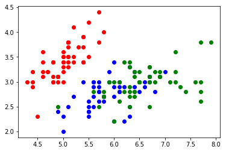


```python
k = 5 ; filename = "iris_grid.pdf";
limits = (4, 8.5, 1.5, 5) ;   h = 0.1

(xx,yy, pred_grid) = make_pred_grid(predictors,outcomes,limits,h,k)
plot_pred_grid(xx,yy, pred_grid, filename)
```


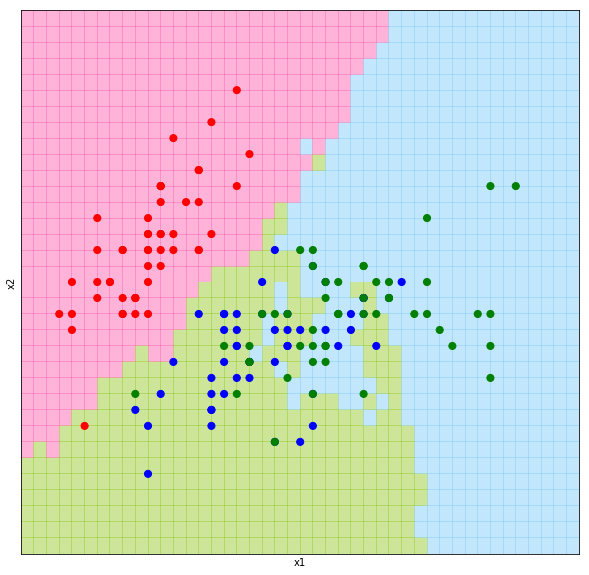


```python
from sklearn.neighbors import KNeighborsClassifier

# 建立knn模型
knn = KNeighborsClassifier(n_neighbors = 5)
knn.fit(predictors,outcomes)
sk_predictions = knn.predict(predictors)
```


```python
sk_predictions.shape
```


    (150,)


```python
sk_predictions[:10]
```


    array([0, 0, 0, 0, 0, 0, 0, 0, 0, 0])


```python
my_predictions = np.array([knn_predict(p,predictors, outcomes, 5) for p in predictors])
my_predictions
```


    array([0, 0, 0, 0, 0, 0, 0, 0, 0, 0, 0, 0, 0, 0, 0, 0, 0, 0, 0, 0, 0, 0,
           0, 0, 0, 0, 0, 0, 0, 0, 0, 0, 0, 0, 0, 0, 0, 0, 0, 0, 0, 1, 0, 0,
           0, 0, 0, 0, 0, 0, 2, 2, 2, 1, 2, 1, 2, 1, 1, 1, 1, 2, 1, 1, 1, 1,
           1, 2, 1, 1, 1, 1, 2, 1, 2, 2, 1, 2, 1, 1, 1, 1, 2, 1, 1, 1, 1, 1,
           1, 1, 1, 1, 1, 1, 1, 1, 1, 2, 1, 1, 2, 2, 2, 2, 2, 2, 1, 2, 2, 2,
           2, 2, 2, 1, 1, 2, 2, 2, 2, 1, 2, 1, 2, 2, 2, 2, 1, 1, 2, 2, 2, 2,
           2, 2, 1, 2, 2, 2, 2, 2, 1, 2, 2, 2, 2, 2, 2, 2, 2, 2])


```python
my_predictions == sk_predictions
```


    array([ True,  True,  True,  True,  True,  True,  True,  True,  True,
            True,  True,  True,  True,  True,  True,  True,  True,  True,
            True,  True,  True,  True,  True,  True,  True,  True,  True,
            True,  True,  True,  True,  True,  True,  True,  True,  True,
            True,  True,  True,  True,  True,  True,  True,  True,  True,
            True,  True,  True,  True,  True,  True,  True,  True,  True,
            True,  True,  True,  True,  True,  True,  True, False,  True,
            True,  True,  True,  True,  True,  True,  True,  True,  True,
            True,  True,  True,  True,  True, False,  True,  True,  True,
            True,  True,  True,  True, False,  True,  True,  True,  True,
            True,  True,  True,  True,  True,  True,  True,  True,  True,
            True,  True,  True,  True,  True,  True,  True,  True,  True,
           False,  True,  True,  True,  True,  True,  True,  True,  True,
            True,  True,  True,  True,  True,  True,  True,  True,  True,
            True,  True,  True,  True,  True,  True,  True,  True,  True,
            True,  True,  True,  True,  True,  True,  True,  True,  True,
            True, False,  True,  True,  True, False])


```python
# 两种算法的对比
print(100 * np.mean(my_predictions == sk_predictions))
```

    96.0
    


```python
# 计算准确率
print(100 * np.mean(my_predictions == outcomes))
print(100 * np.mean(sk_predictions == outcomes))
```

    84.66666666666667
    83.33333333333334
    

## 小结:
    1. kNN is particularly useful when no other model fits your data well, 
    因为它是一个不需要参数的分类方法. 例如,你不需要考虑你的数据是线性可分还是线性不可分.
    
    2. 要想用kNN算法,我们的数据必须是可测的(数据集上有距离可以定义出来).

## 10. kNN应用(2)
mglearn.plots.plot_classification()


```python
import mglearn  
import matplotlib.pyplot as plt  
from sklearn.datasets import load_boston  
  
boston = load_boston()  
  
print("数据形状:{}".format(boston.data.shape))  

# 生成扩展数据集  
X, y = mglearn.datasets.load_extended_boston()  
print("X.shape:{}".format(X.shape))  
    
mglearn.plots.plot_knn_classification(n_neighbors=1)  
plt.show()  
```

    数据形状:(506, 13)
    X.shape:(506, 104)
    


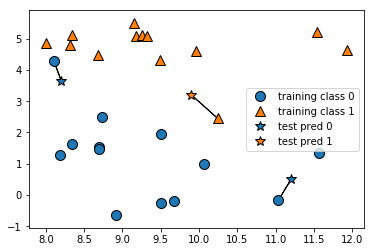


(2)计算决策边界.


```python
from sklearn.model_selection import train_test_split  
from sklearn.neighbors import KNeighborsClassifier    
X,y = mglearn.datasets.make_forge()  
X_train, X_test, y_train, y_test = train_test_split(X,y, random_state=0)  

n_neighbors =1
# KNeighborsClassifier类的实例化 
clf = KNeighborsClassifier(n_neighbors= n_neighbors)  
clf.fit(X_train, y_train)  
print("测试集预测: {}".format(clf.predict(X_test)))  
print("测试集准确度: {:.3f}".format(clf.score(X_test,y_test)))  

clf = KNeighborsClassifier(n_neighbors=n_neighbors).fit(X,y) 
#边界
mglearn.plots.plot_2d_separator(clf, X, fill=True, eps=0.5, alpha=0.4)  
# 散点图
mglearn.discrete_scatter(X[:,0],X[:,1],y)  
plt.title("{} neighbor(s)".format(n_neighbors))  
plt.xlabel("X0")  
plt.ylabel("X1")  
plt.legend(loc=3)  
plt.show()  
```

    测试集预测: [1 0 1 0 1 0 0]
    测试集准确度: 0.857
    


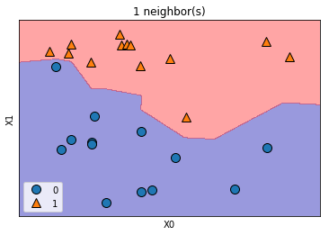


k越大,边界越光滑.

k越小,模型越复杂.(复杂度大)

k越大,模型越简单. 

k极其大,所有测试数据对应预测值都一样.


(3) 测试性能和准确度.


```python
from sklearn.datasets import load_breast_cancer   
 
cancer = load_breast_cancer()  
X_train, X_test, y_train, y_test = train_test_split(  
        cancer.data, cancer.target, stratify=cancer.target, random_state=6)  
 
training_accuracy = []  
test_accuracy = []  
  
# try n_neighbors from 1 to 10  
neighbors = range(1,11)  
  
for n_neighbors in neighbors:  
    # build the model  
    clf = KNeighborsClassifier(n_neighbors=n_neighbors)  
    clf.fit(X_train,y_train)  
    #record training set accuracy  
    training_accuracy.append(clf.score(X_train,y_train))  
    #record generalization accuracy  
    test_accuracy.append(clf.score(X_test,y_test))  
  
plt.plot(neighbors,training_accuracy,  "o-",label="training")  
plt.plot(neighbors,test_accuracy,  "o-",label="test")  
plt.ylabel("Accuracy")  
plt.xlabel("k")  
plt.legend()  
```


    <matplotlib.legend.Legend at 0x18000038c50>


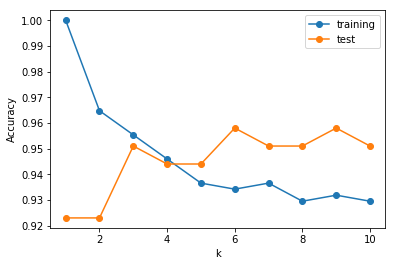


k越小,模型越复杂.(复杂度大,过拟合: 对于训练集的预测是完美的.但对于测试集的预测表现很差劲. Too complex Model!)

随着k增大,模型越来越简单. 训练集上的准确度降低.但测试集上的准确度逐渐增大.

当k过大时,测试集上的准确度甚至比单邻居情形更惨. 表现很好的模型是k位于[1,10]之间的某个值的哪些模型.
(注意:这里的模型表现都还不错!)


当k取得极其大,所有测试数据对应预测值都一样.

## 11. kNN回归算法


```python
from sklearn.model_selection import train_test_split   
from sklearn.datasets import load_breast_cancer  
#import matplotlib.pyplot as plt  
#import mglearn  
  
X,y = mglearn.datasets.make_forge() 
# 数据集分割
X_train, X_test, y_train, y_test = train_test_split(X, y, random_state=0)  
# 选单个邻居数为1时, 目标值就是其最近邻居之目标值.(这就是k=1时的kNN回归) 
mglearn.plots.plot_knn_regression(n_neighbors=1)
plt.show() 
```


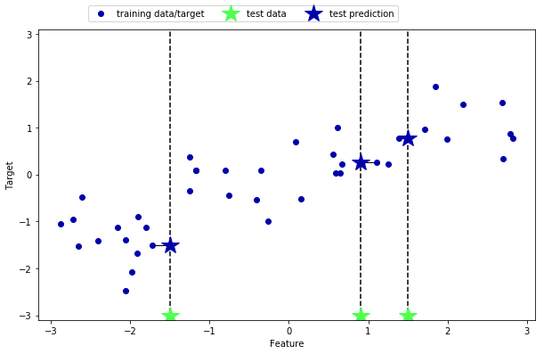


```python
X,y = mglearn.datasets.make_forge() 
# 数据集分割
X_train, X_test, y_train, y_test = train_test_split(X, y, random_state=0)  
# 选单个邻居数为3时, 目标值就是其最近3个邻居之目标值之平均值.(这就是k=3时的kNN回归) 
mglearn.plots.plot_knn_regression(n_neighbors=3)
plt.show() 
```


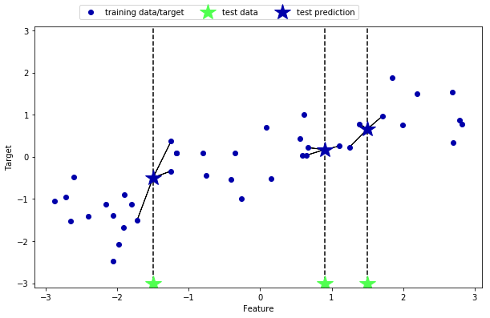


```python
from sklearn.neighbors import KNeighborsRegressor
X,y = mglearn.datasets.make_wave(n_samples=40)
# 分割数据集
X_train, X_test, y_train, y_test = train_test_split(X, y, random_state=0)
# 实例化模型,k=3
reg = KNeighborsRegressor(n_neighbors=3)
# 利用数据拟合模型
reg.fit(X_train,y_train)
```


    KNeighborsRegressor(algorithm='auto', leaf_size=30, metric='minkowski',
              metric_params=None, n_jobs=1, n_neighbors=3, p=2,
              weights='uniform')


```python
# 现在在新的数据集上做预测
print("X_test:",X_test)
print("Test set predictions:\n{}".format(reg.predict(X_test)))
```

    X_test: [[-1.24713211]
     [ 0.67111737]
     [ 1.71105577]
     [-2.06388816]
     [-2.87649303]
     [-1.89957294]
     [ 0.55448741]
     [ 2.81945911]
     [-0.40832989]
     [-2.72129752]]
    Test set predictions:
    [-0.05396539  0.35686046  1.13671923 -1.89415682 -1.13881398 -1.63113382
      0.35686046  0.91241374 -0.44680446 -1.13881398]
    

### 拟合优度
利用score()方法评估模型. 对回归算法,它返回判定系数$R^2$之值. (coefficient of determination),又称拟合优度.

$R^2$是测量回归模型好坏的一个量. 取值在[0,1]之间. $R^2=1$表示模型可以做完美的预测; $R^2=0$表示该模型只能做出预测值mean(y_train).

设一数据集包括$y_1,...,y_n$共n个观察值，相对应的模型预测值分别为$f_1,...,f_n$. 

定义残差$e_i = y_i - f_i$，平均观察值为

$\bar{y}=\frac{1}{n}\sum_{i=1}^{n}y_i$.

决定系数定义为

$R^{2}\equiv 1-{SS_{\rm {res}} \over SS_{\rm {tot}}}$.

其中,总平方和

$SS_{\text{tot}}=\sum_{i}(y_i-{\bar y})^2$

回归平方和

$SS_{\text{reg}}=\sum _{i}(f_{i}-{\bar {y}})^{2}$,

残差平方和

$SS_{\text{res}}=\sum_{i}(y_{i}-f_{i})^{2}=\sum _{i}e_{i}^{2}$,


```python
print("测试集拟合优度:{:.3f}".format(reg.score(X_test,y_test)))
```

    测试集拟合优度:0.834
    

### kNN回归分析


```python
#如果数据仅有一个特征,利用array.reshape(-1, 1)改变数组形状;
#如果数据中仅包含一个样本,则可利用array.reshape(1, -1)改变数组形状.
line = np.linspace(-3,3, 1000).reshape(-1,1)
n_neighbors = 1 # 可改变k值
reg = KNeighborsRegressor(n_neighbors=n_neighbors)
reg.fit(X_train,y_train)
plt.plot(line[:,0], reg.predict(line))
plt.plot(X_train[:,0],y_train, "o", c="r")
plt.plot(X_test[:,0],y_test, "v", c="b")

plt.title("{} neighbor(s)\n train score:{:.2f} test score: {:.2f}".format(n_neighbors, reg.score(X_train,y_train),
                                                                          reg.score(X_test,y_test)))
plt.xlabel("Feature")
plt.ylabel("Target")
plt.legend(["Predictions", "Training data/target", "Test data/target"])
```


    <matplotlib.legend.Legend at 0x1807b32c358>


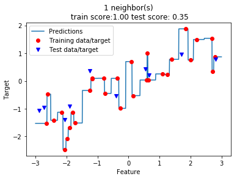

